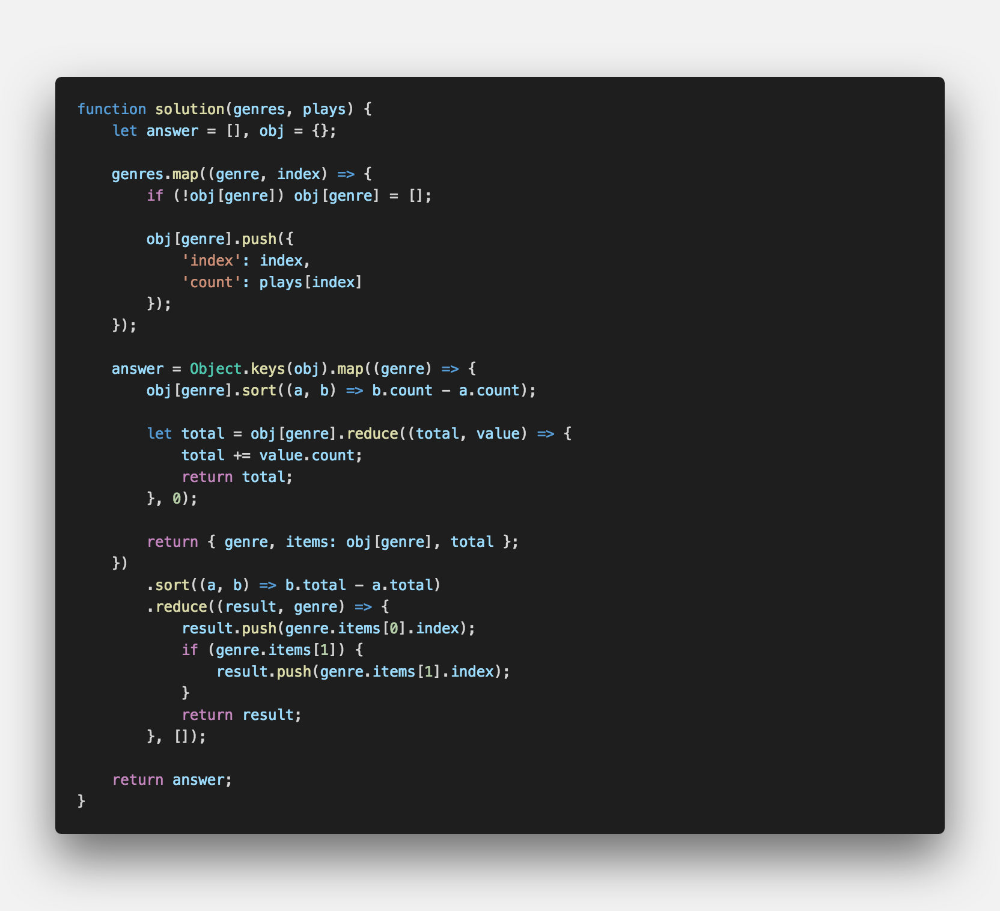

문제 설명
-------

- 배열 array의 i번째 숫자부터 j번째 숫자까지 자르고 정렬했을 때, k번째에 있는 수를 구하려 합니다.

- 예를 들어 array가 [1, 5, 2, 6, 3, 7, 4], i = 2, j = 5, k = 3이라면
    
    - [1] array의 2번째부터 5번째까지 자르면 [5, 2, 6, 3]입니다.

    - [2] 1에서 나온 배열을 정렬하면 [2, 3, 5, 6]입니다.

    - [3] 2에서 나온 배열의 3번째 숫자는 5입니다.

- 배열 array, [i, j, k]를 원소로 가진 2차원 배열 commands가 매개변수로 주어질 때, 

- commands의 모든 원소에 대해 앞서 설명한 연산을 적용했을 때 나온 결과를 배열에 담아 return 하도록 solution 함수를 작성해주세요.

제한 사항
-------

- array의 길이는 1 이상 100 이하입니다.

- array의 각 원소는 1 이상 100 이하입니다.

- commands의 길이는 1 이상 50 이하입니다.

- commands의 각 원소는 길이가 3입니다.

입출력 예
-------

문제 풀이
-------

#끝까지 봐 주셔서 감사합니다.  ʕ　·ᴥʔ

 

> 출처  <a href="https://programmers.co.kr/learn/courses/30/lessons/42748" target="_blank">https://programmers.co.kr/learn/courses/30/lessons/42748</a>
