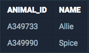

<center><strong style="color:#fbc2eb">프로그래머스</strong>에서 주최하는 SQL 문제 풀이</center>

<br />

<center>의미 있는 데이터를 뽑으려면 테이블을 여러 개 쓸 줄 알아야 하죠.<br />서브 쿼리와 JOIN문은 어떻게 쓰는 건지 알아봅시다.</center>

## **💎 목차**
  * [문제 설명 (Problem)](#-문제-설명)
  * [입출력 예 (Example)](#-입출력-예)
  * [문제 풀이 (Solution)](#-문제-풀이)

## **📕 문제 설명**

- `ANIMAL_INS` 테이블은 동물 보호소에 들어온 동물의 정보를 담은 테이블입니다.

- `ANIMAL_INS` 테이블 구조는 다음과 같으며,

- `ANIMAL_ID`, `ANIMAL_TYPE`, `DATETIME`, `INTAKE_CONDITION`, `NAME`, `SEX_UPON_INTAKE` 는

- 각각 동물의 아이디, 생물 종, 보호 시작일, 보호 시작 시 상태, 이름, 성별 및 중성화 여부를 나타냅니다.

<br />


<br />

- `ANIMAL_OUTS` 테이블은 동물 보호소에서 입양 보낸 동물의 정보를 담은 테이블입니다. 

- `ANIMAL_OUTS` 테이블 구조는 다음과 같으며, 

- `ANIMAL_ID`, `ANIMAL_TYPE`, `DATETIME`, `NAME`, `SEX_UPON_OUTCOME` 는 

- 각각 동물의 아이디, 생물 종, 입양일, 이름, 성별 및 중성화 여부를 나타냅니다. 

- `ANIMAL_OUTS` 테이블의 `ANIMAL_ID`는 `ANIMAL_INS`의 `ANIMAL_ID`의 외래 키입니다.


<br />

- 천재지변으로 인해 일부 데이터가 유실되었습니다.

- 입양을 간 기록은 있는데, 보호소에 들어온 기록이 없는 `ANIMAL_ID`와 `NAME`을 `ANIMAL_ID` __순__으로 조회하는 SQL문을 작성해주세요.

<br />

**[⬆ 목차](#-목차)**

---

## **📙 입출력 예**

- 예를 들어, `ANIMAL_INS` 테이블과 `ANIMAL_OUTS` 테이블이 다음과 같다면

__ANIMAL_INS__


<br />

__ANIMAL_OUTS__


<br />

`ANIMAL_OUTS` 테이블에서
- Allie의 ID는 ANIMAL_INS에 없으므로, Allie의 데이터는 유실되었습니다.
- Gia의 ID는 ANIMAL_INS에 있으므로, Gia의 데이터는 유실되지 않았습니다.
- Spice의 ID는 ANIMAL_INS에 없으므로, Spice의 데이터는 유실되었습니다.

따라서 SQL문을 실행하면 다음과 같이 나와야 합니다.

<br />


<br />

**[⬆ 목차](#-목차)**

---

## **📘 문제 풀이**

```js

SELECT 'O.ANIMAL_ID', 'O.NAME'
FROM 'ANIMAL_OUTS' AS 'O'
LEFT JOIN 'ANIMAL_INS' AS 'I' ON 'O.ANIMAL_ID' = 'I.ANIMAL_ID'
WHERE 'I.ANIMAL_ID' IS NULL
ORDER BY 'O.ANIMAL_ID'

```

<br />

**[⬆ 목차](#-목차)**

---

<br />

> 출처
>
> <a href="https://programmers.co.kr/learn/courses/30/lessons/59042" target="_blank">코딩테스트 연습 > SQL > 없어진 기록 찾기</a>

#여러분의 댓글이 큰힘이 됩니다. (๑•̀ㅂ•́)و✧
