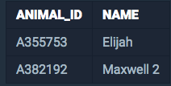

<center><strong style="color:#FDE2BF; font-size: 20px;">프로그래머스</strong>에서 주최하는 SQL 문제 풀이</center>

<br />

## **💎 목차**

- [문제 설명 (Problem)](#-문제-설명)
- [입출력 예 (Example)](#-입출력-예)
- [문제 풀이 (Solution)](#-문제-풀이)

## **📕 문제 설명**

- `ANIMAL_INS` 테이블은 동물 보호소에 들어온 동물의 정보를 담은 테이블입니다.

- `ANIMAL_INS` 테이블 구조는 다음과 같으며,

- `ANIMAL_ID`, `ANIMAL_TYPE`, `DATETIME`, `INTAKE_CONDITION`, `NAME`, `SEX_UPON_INTAKE`는

- 각각 동물의 아이디, 생물 종, 보호 시작일, 보호 시작 시 상태, 이름, 성별 및 중성화 여부를 나타냅니다.

<br />


<br />

- 보호소에 돌아가신 할머니가 기드런 개를 찾는 사람이 찾아왔습니다.

- 이 사람이 말하길 할머니가 기르던 개는 이름에 'el'이 들어간다고 합니다.

- 동물 보호소에 들어온 동물 이름 중, 이름에 'el'이 들어가는 개의 아이디와 이름을 조회하는 SQL 문을 작성해주세요.

- 이때 결과는 이름 순으로 조회해주세요. 단, 이름의 대소문자는 구분하지 않습니다.

<br />

**[⬆ 목차](#-목차)**

<hr />

## **📙 입출력 예**

- 예를 들어, `ANIMAL_INS` 테이블이 다음과 같다면


<br />

- 이름에 'el'이 들어가는 동물은 Elijah, Ella, Maxwell 2입니다.

- 이 중, 개는 Elijah, Maxwell 2입니다.

따라서 SQL문을 실행하면 다음과 같이 나와야 합니다.


<br />

<br />

**[⬆ 목차](#-목차)**

<hr />

## **📘 문제 풀이**

```js

SELECT 'ANIMAL_ID', 'NAME'
FROM 'ANIMAL_INS'
WHERE 'ANIMAL_TYPE' = 'Dog'
AND 'NAME' LIKE '%el%'
ORDER BY 'NAME' ASC

```

<br />

**[⬆ 목차](#-목차)**

<hr />

<br />

> 출처
>
> <a href="https://programmers.co.kr/learn/courses/30/lessons/59047" target="_blank">코딩테스트 연습 > String, Date > 이름에 el이 들어가는 동물 찾기</a>

# 여러분의 댓글이 큰힘이 됩니다. (๑•̀ㅂ•́)و✧
