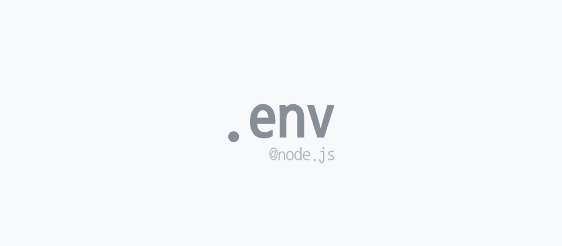
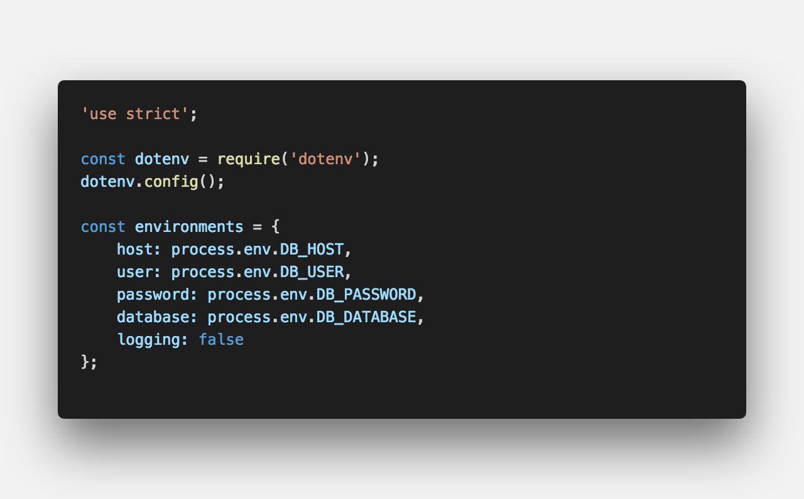
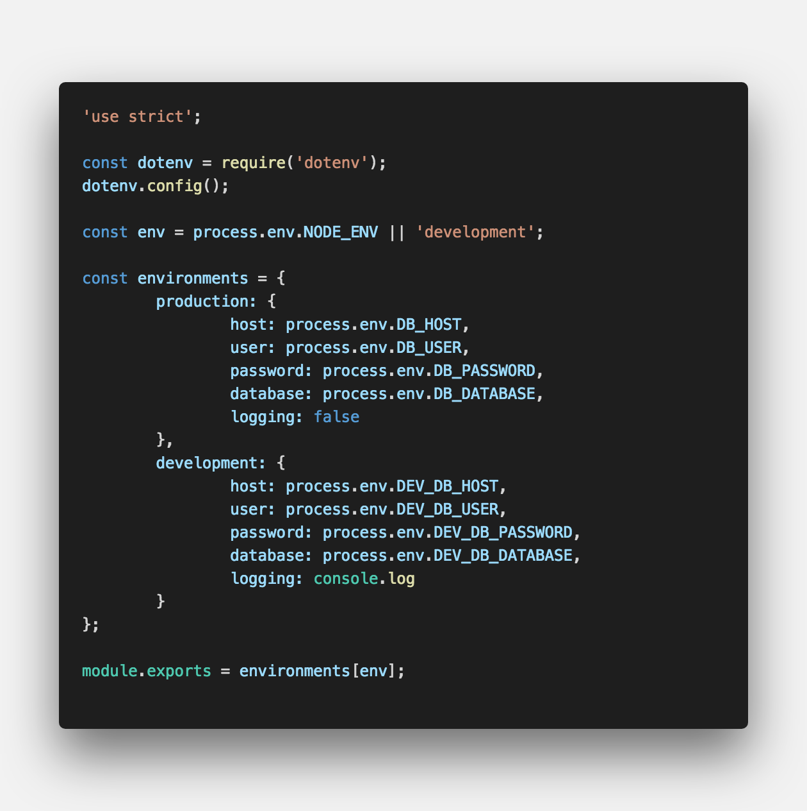
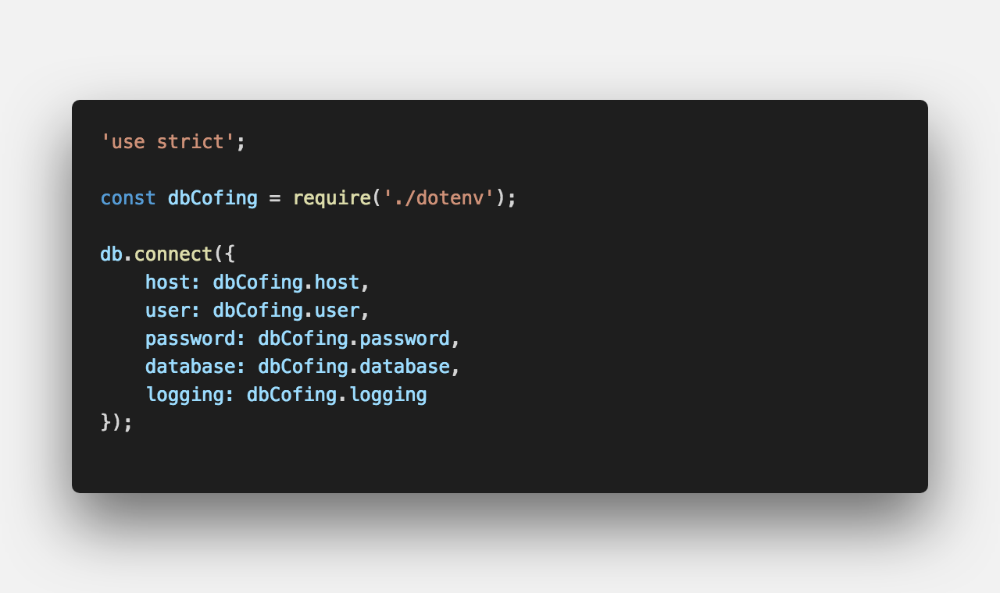

<center><strong style="color:#7B828B; font-size: 20px;">환경변수</strong>를 관리할 수 있는 라이브러리</center>

## **💎 목차**

- [설치를 하며](#️-설치를-하며)
- [코드를 보며](#-코드를-보며)
- [생각 해보며](#-생각해-보며)

## **⚙️ 설치를 하며**

```sh

$ npm install dotenv

```

<br />

**[⬆ 목차](#-목차)**

<hr />

## **😳 코드를 보며**

### ▸ .env

```sh

DB_HOST = host
DB_USER = user
DB_PASSWORD = password
DB_DATABASE = database

```

<br />

### ▸ dotenv


<br />

- `dotenv.config()` .env 파일에서 변수들을 불러온다

<br />

**[⬆ 목차](#-목차)**

<hr />

## **🤔 생각해 보며**

- `dotenv` 활용하여 동적으로 환경변수를 관리할수있다.

### ▸ dotenv

```sh

DB_HOST = host
DB_USER = user
DB_PASSWORD = password
DB_DATABASE = database

DEV_DB_HOST = dev_host
DEV_DB_USER = dev_user
DEV_DB_PASSWORD = dev_password
DEV_DB_DATABASE = dev_database


```

- 이 처럼 `배포환경`과 `개발환경` 변수를 분리

<br />


<br />

- `scripts` 실행 시 `NODE_ENV` 환경변수를 삽입하여 배포와 개발 명령어를 분리

<br />


<br />

- `NODE_ENV` 환경변수에 맞게 `exports`

<br />


<br />

- `require` 데이터를 가져와서 `db.connect`

<br />

**[⬆ 목차](#-목차)**

<hr />

<br />

> 출처
>
> <a href="https://github.com/bynodejs/dotenv" target="_blank">GitHub > dotenv</a>

# 여러분의 댓글이 큰힘이 됩니다. (๑•̀ㅂ•́)و✧
