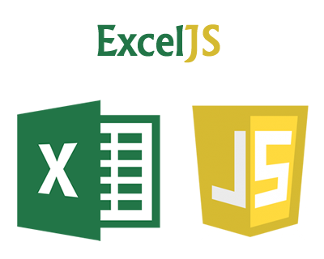
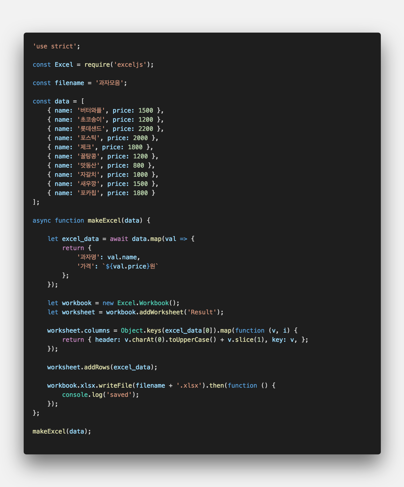
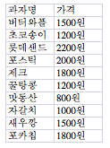
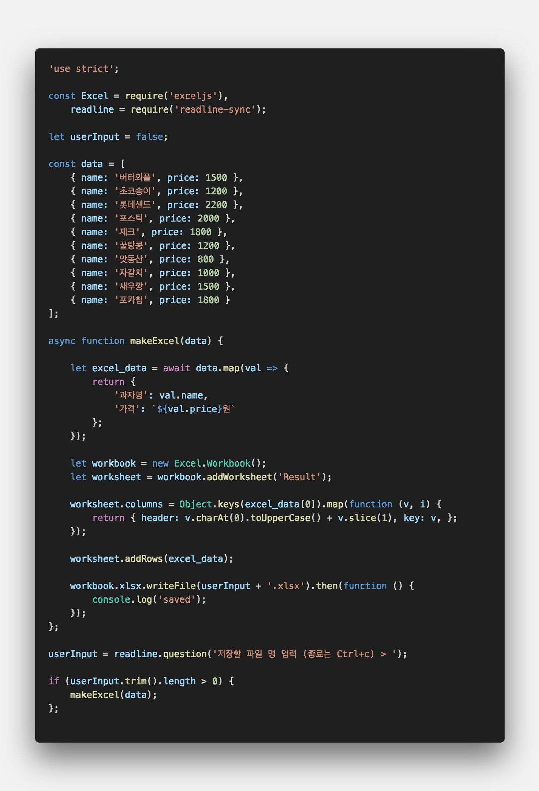

<center><strong style="color:#3C734B">스프레드 시트</strong>을 쉽게 읽고 조작할 수 있는 라이브러리이다.</center>

## **💎 목차**

- [설치를 하며](#️-설치를-하며)
- [코드를 보며](#-코드를-보며)
- [생각 해보며](#-생각해-보며)

## **⚙️ 설치를 하며**

```sh

$ npm install exceljs

```

## **😳 코드를 보며**


<br />

- `data`는 `Array<Object>`로 { KEY : VALUE } 구성을 하였습니다.

1. 해당 `data`를 `map`을 통해 새로운 배열로 반환하여 엑셀 `header` 추가

2. `Object.keys`를 통해 해당 header를 정의하고 `addRows`로 데이터 삽입

3. `writeFile`로 엑셀 파일로 저장

<br />

Excel 파일입니다.


<br />

**[⬆ 목차](#-목차)**

---

## **🤔 생각해 보며**

`완성도`와 `세련도`를 높이고자 모듈을 추가해보자.

```sh

// 콘솔 입력 모듈
$ npm install readline-sync

```

<br />


<br />

1. `readline` 모듈을 통해 저장할 파일명 입력

<br />

**[⬆ 목차](#-목차)**

---

<br />

> 출처
>
> <a href="https://github.com/bynodejs/exceljs" target="_blank">GitHub > exceljs</a>

# 여러분의 댓글이 큰힘이 됩니다. (๑•̀ㅂ•́)و✧
