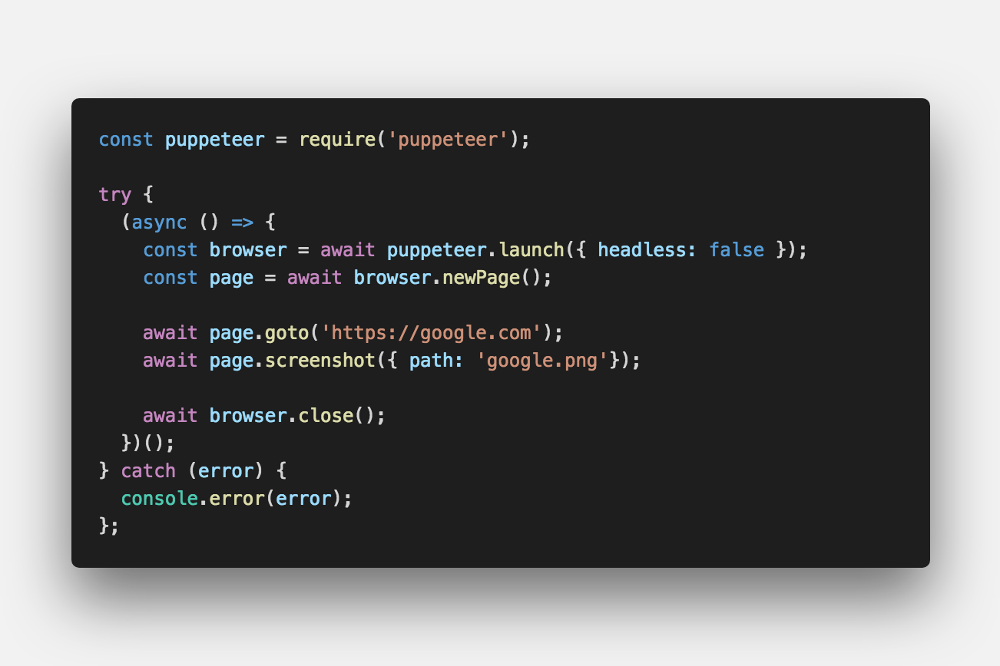

  
<center><strong>Headless Chrome</strong>을 쉽게 사용할 수 있는 node.js 라이브러리이다.</center>

▶︎ 설치를 하며...
-------------
```sh

npm install puppeteer

```

▶︎ 기능을 살피며...
-------------

####▸ screenshot
*   스크린샷을 저장한다.<br />


<br /><br />

####▸ pdf
*   PDF 파일을 저장한다.<br />


<br /><br />

####▸ emulate devices
*   디바이스 모드로 전환한다.<br />


<br /><br />

####▸ setCookie
*   쿠키를 설정한다.<br />


<br /><br />

####▸ tracing
*   접속 브라우저 정보를 추적한다.<br />  


<br /><br />

▶︎ 추가적으로...
-----------

- 크롤링 소스를 조금 더 세련되면서 편의를 위해 몇 가지 모듈을 추가 해보았다.

1. cheerio

2. exceljs

3. readline-sync

다음은 앞서 말한 세 가지 모듈을 활용하여 소스를 작성 해보았다. 

> 참고  https://github.com/bynodejs/crawling
