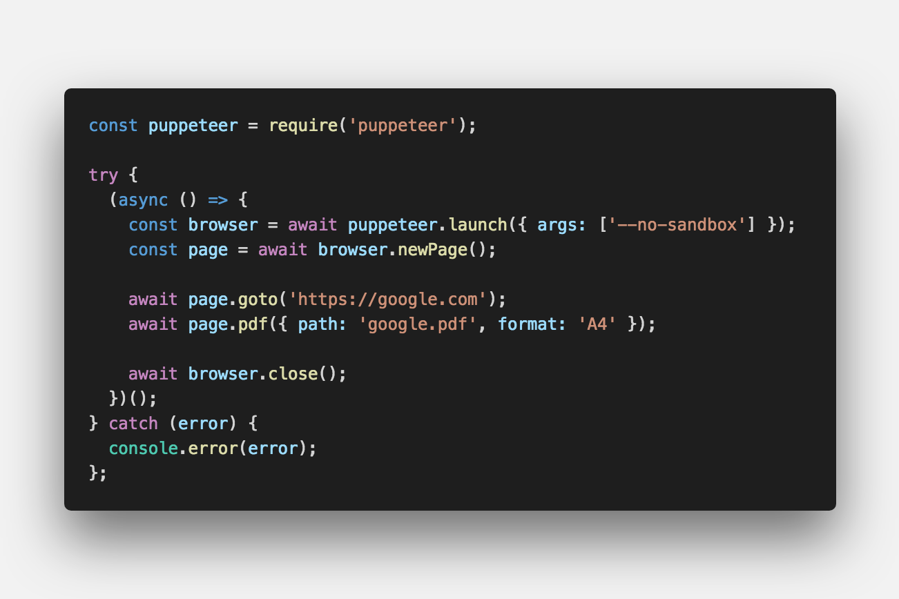
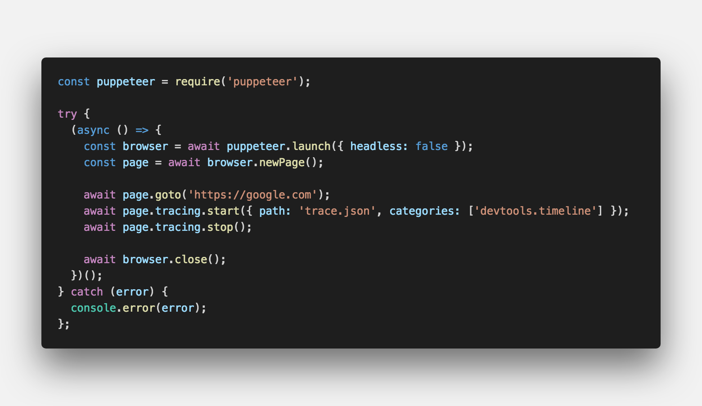

<center><strong style="color:#05D197">Headless Chrome</strong> 쉽게 사용할 수 있는 Node Js 라이브러리이다.</center>

## **💎 목차**

- [설치를 하며](#️-설치를-하며)
- [코드를 보며](#-코드를-보며)
- [생각 해보며](#-생각해-보며)

## **⚙️ 설치를 하며**

```jssh

$ npm install puppeteer

```

## **😳 코드를 보며**

### ▸ screenshot


<br />

- 스크린샷을 저장한다.

<hr />

### ▸ pdf


<br />

- PDF 파일을 저장한다.

<hr />

### ▸ emulate devices


<br />

- 디바이스 모드로 전환한다.

<hr />

### ▸ setCookie


<br />

- 쿠키를 설정한다.

<hr />

### ▸ tracing


<br />

- 접속 브라우저 정보를 추적한다.

<br />

**[⬆ 목차](#-목차)**

---

## **🤔 생각해 보며**

`완성도`와 `세련도`를 높이고자 몇 가지 모듈을 추가해보자.

```sh

// HTML DOM Element 접근에 용이한 모듈
$ npm install cheerio

// Excel 파일 생성 모듈
$ npm install exceljs

// 콘솔 입력 모듈
$ npm install readline-sync

```

<br />


<br />

해당 소스는 `네이버 맵` 크롤링 소스이다. 간략히 설명 하겠습니다.

1. `readline` 모듈을 통해 검색어를 입력

2. `cheerio` 모듈을 통해 손쉽게 Element 접근

3. `exceljs` 모듈을 통해 데이터 수집이 완료 시 Excel 저장

<br />

**[⬆ 목차](#-목차)**

---

<br />

> 출처
>
> <a href="https://github.com/bynodejs/crawling" target="_blank">GitHub > crawling</a>

# 여러분의 댓글이 큰힘이 됩니다. (๑•̀ㅂ•́)و✧
