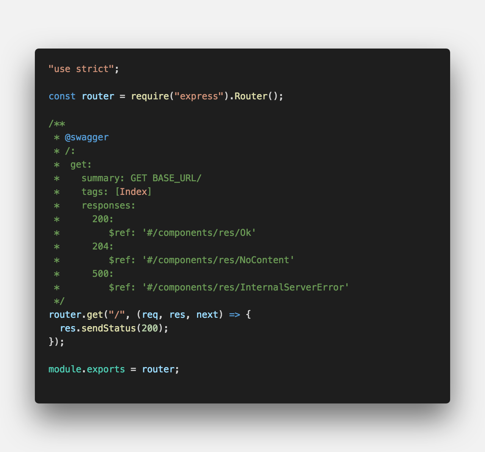
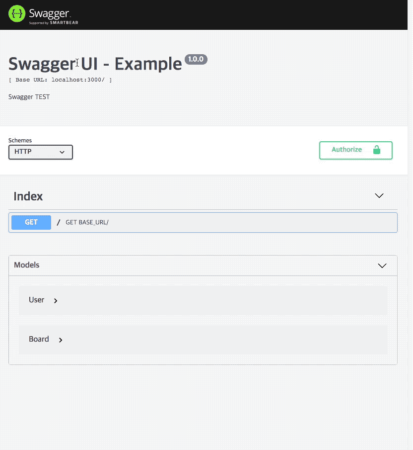

<center>개발자가 <strong style="color:#93BB53; font-size: 20px;">RESTful 웹 서비스를 설계, 빌드, 문서화</strong>를 도와주는 프레임 워크</center>

## **💎 목차**

- [설치를 하며](#️-설치를-하며)
- [코드를 보며](#-코드를-보며)
- [생각 해보며](#-생각해-보며)

## **⚙️ 설치를 하며**

```sh

$ npm install express

$ npm install swagger-jsdoc

$ npm install swagger-ui-express

```

<br />

**[⬆ 목차](#-목차)**

<hr />

## **😳 코드를 보며**

### ▸ app.js


<br />

`app.use()` 라우트 경로 지정 할때,

`swaggerUi.serve, swaggerUi.setup(swaggerJSDoc()` swaager 환경 파일 지정

<br />
<hr />

### ▸ /lib/swagger.js


<br />

- `components` 응답 스키마를 정의

- `definitions` Models 정의

- `apis` request 라우터 경로

<br />
<hr />

### ▸ /routes/index.js


<br />

```sh

/**
 * @swagger         { swagger 지정 }
 * /:               { 요청 경로 }
 *  get:            { 요청 메소드 }
 *   summary: text  { 간략 설명 }
 *   tags: [Index]  { 태그 }
 *   responses:     { 응답 데이터 swagger 참고}
 *       200:
 *           $ref: '#/components/res/Ok'
 *       204:
 *           $ref: '#/components/res/NoContent'
 *       500:
 *           $ref: '#/components/res/InternalServerError'
 */

```

경로를 통해 데이터를 요청해서 해당 응답 코드에 맞게 제공

<br />


<br />

Swagger UI를 통한 결과물이다.

<br />

**[⬆ 목차](#-목차)**

<hr />

## **🤔 생각해 보며**


<br />

- `USER` 유저 API, `BOARD` 게시글 API 예시입니다.

- 소스를 이해하고 개선하면서 추후에는 `DATABASE`도 연동해보시길 바랍니다.

- 혹여 더 좋은 방법이 있으시면 공유도 부탁드립니다.

<br />

**[⬆ 목차](#-목차)**

<hr />

<br />

> 출처
>
> <a href="https://github.com/bynodejs/swagger" target="_blank">GitHub > swagger</a>

# 여러분의 댓글이 큰힘이 됩니다. (๑•̀ㅂ•́)و✧
