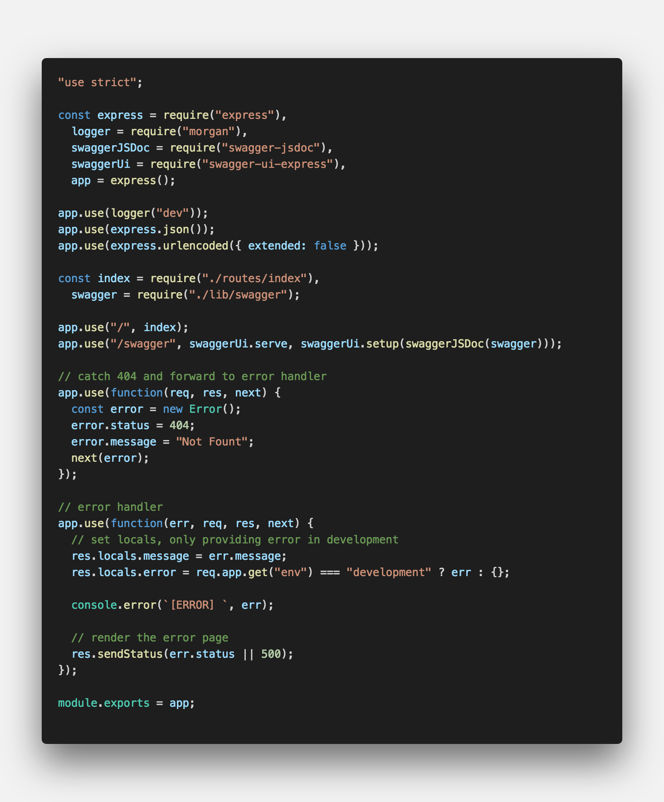

<!-- ---
title: ' RESTful 개발 도구 📋 ▻ swagger '
date: 2019-09-10 18:22:00
category: 'Node Js'
---


<center>개발자가 <strong style="color:#93BB53">RESTful 웹 서비스를 설계, 빌드, 문서화</strong>를 도와주는 프레임 워크</center>

## **💎 목차**

- [설치를 하며](#️-설치를-하며)
- [코드를 보며](#-코드를-보며)
- [생각 해보며](#-생각해-보며)

## **⚙️ 설치를 하며**

```sh

$ npm install express

$ npm install swagger-jsdoc

$ npm install swagger-ui-express

```

## **😳 코드를 보며**

### ▸ app.js


<br />

- `swagger-jsdoc`와 `swagger-ui-express`를 require

- `app.use()` 라우트 경로 지정 후

- `swaggerUi.serve, swaggerUi.setup(swaggerJSDoc()` swaager 환경 파일 지정

<br />

<hr />

### ▸ /lib/swagger.js


<br />

중점으로 봐야할 부분은 `components`, `definitions` 이다.

1. components

- status 결과값을 지정해주고 해당 status 응답이 올 경우 결과값 송신해준다.

2. definitions

- 모델 정의

<br />

<hr />

회원에 관한 RESTful API를 테스트 해보기에

앞서 API를 컨트롤하기 위한 `REQUEST METHOD` 부터 설명하겠습니다.

- param

- query

- body

이다.

각각의 설명을 하자면

1. req.param

주소에 포함된 변수를 담는다.

예를 들어 `http://localhost:3000/123` 이라는 주소는 123을 담는다.

즉, key 값을 표시해주지 않는다.

<br />

2. req.query

주소의 ? 이후의 변수를 담는다.

예를 들어 `http://localhost:3000?query=123` 이라는 주소는

{ key: query, value: 123 } 을 의미한다.

3. req.body

XML, JSON, Multi Form 등의 데이터를 담는다.

주소에선 확인 할수 없어서 보안상 안전하다.

<br />

<hr />

추가적으로 `HTTP METHOD` 관련 설명을 하겠습니다.

RESTful API 개발에서는 주로

- POST (Create)

- GET (Read)

- PUT (Update)

- DELETE (Delete)

라고 통칭 **CRUD** 라고 부른다.

협업이나 개인 프로젝트 개발시에도 정해진 규칙으로 개발시

이해로를 높힐수 있다.

- POST (Create)를 통해 해당 URI를 요청하면 리소스를 `생성`합니다.

- GET (Read)를 통해 해당 리소스를 `조회`와 Request 메소드를 활용 `상세 정보`를 가져온다.

- PUT (Update)를 통해 해당 리소스를 `수정`합니다.

- DELETE (Delete)를 통해 해당 리소스를 `삭제`합니다.

이 처럼 Request 메소드와 HTTP 메소드가 RESTful API 설계하는 중심 규칙입니다.

**[⬆ 목차](#-목차)**

---

## **🤔 생각해 보며**

<br />

**[⬆ 목차](#-목차)**

---

<br />

> 출처
>
> <a href="https://github.com/bynodejs/swagger" target="_blank">GitHub > swagger</a>

# 여러분의 댓글이 큰힘이 됩니다. (๑•̀ㅂ•́)و✧ -->
